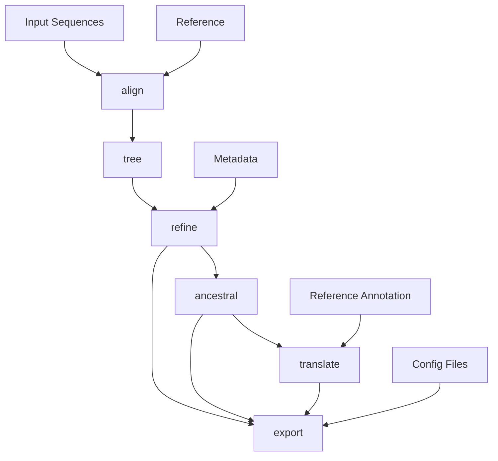

# Norovirus Phylogenetics Pipeline


This is a bioinformatics pipeline for building interactive norovirus phylogenetics trees that can be visualized using the Augur / Nextstrain / Auspice workflow. 


# Norovirus Phylogenetics Pipeline

This Nextflow pipeline implements a series of bioinformatics analyses for Norovirus phylogenetics using the Augur toolkit.

## Analyses Performed

The pipeline performs the following analyses:
1. Sequence concatenation / filtering 
2. Sequence alignment
3. Phylogenetic tree construction
4. Tree refinement
5. Ancestral state reconstruction
6. Sequence translation
7. Data export for visualization

## Pipeline Workflow



## Usage

To run the pipeline, use the following command:

```bash
nextflow run BCCDC-PHL/noro-phylo-nf -r 0.1.0 --sequences /path/to/multi.fasta --outdir /path/to/output --reference /path/to/reference.fasta --run_name test1
```

### Parameters:

- `--sequences` for a single multi-FASTA file
- `--outdir`: Output directory
- `--reference`: Path to the reference genome file
- `--metadata`: Path to metadata file (optional)
- `--reference_annotation`: Path to reference annotation file (required if reference is not in GenBank format)
- `--config_auspice`: Path to Auspice config file
- `--config_colors`: Path to colors config file
- `--config_lat_long`: Path to latitude/longitude config file

## Output Files

| File Name | Description |
|-----------|-------------|
| `aligned.fasta` | Multiple sequence alignment |
| `tree.nwk` | Phylogenetic tree in Newick format |
| `tree.refined.nwk` | Refined phylogenetic tree |
| `branch_lengths.json` | Branch length information |
| `traits.json` | Reconstructed trait data |
| `nt_muts.json` | Nucleotide mutations |
| `aa_muts.json` | Amino acid mutations |
| `auspice.json` | JSON file for visualization in Auspice |

## Dependencies

This pipeline requires:
- Nextflow
- Augur toolkit
- Other bioinformatics tools (as specified in the Nextflow config)


## Contact

- John Palmer
- john.palmer@bccdc.ca
